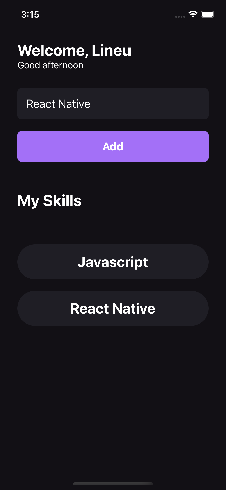

<h2 align="center">
  
</h2>

<h2 align="center">
	My skills
</h2>

<br />

<p align="center">
  

  

  <a href="https://github.com/lineuxyz/my-skills/commits/main">
    
  </a>

  
</p>

<br />
<br />


# 📚 Project

Github explorer is a project in which you enter a repository and it will list a series of information about the repo, such as stars, issues, forks.

<br />
<br />

# 🖥 Technologies

This project was developed with the following technologies:

- [React](https://reactjs.org)
- [React-native](https://reactnative.dev/)
- [Typescript](https://www.typescriptlang.org/)

<br />
<br />

# 🔖 Layout

<p align="center">
  
  
</p>

<br />
<br />

# ❓ How To Use

To clone and run this application, you'll need [Git](https://git-scm.com), [Node.js][nodejs] + [Yarn][yarn] installed on your computer.

From your command line:

### Clone the project
```bash
# Clone this repository
$ git clone https://github.com/lineuxyz/my-skills

# Go into the repository
$ cd my-skills

# Install dependencies
$ yarn install

# Run project
$ yarn start
```

<br />
<br />

# 🤔 How to contribute

- Make a fork;
- Create a branck with your feature: `git checkout -b my-feature`;
- Commit changes: `git commit -m 'feat: My new feature'`;
- Make a push to your branch: `git push origin my-feature`.

After merging your receipt request to done, you can delete a branch from yours.

<br />
<br />

## 📜 License

This project is under the MIT license. See the [LICENSE](LICENSE.md) for details.

#

Made with ❤️ by [Lineu Pastorelli]()

[nodejs]: https://nodejs.org/
[yarn]: https://yarnpkg.com/
[vc]: https://code.visualstudio.com/
[vceditconfig]: https://marketplace.visualstudio.com/items?itemName=EditorConfig.EditorConfig
[vceslint]: https://marketplace.visualstudio.com/items?itemName=dbaeumer.vscode-eslint
[prettier]: https://marketplace.visualstudio.com/items?itemName=esbenp.prettier-vscode
